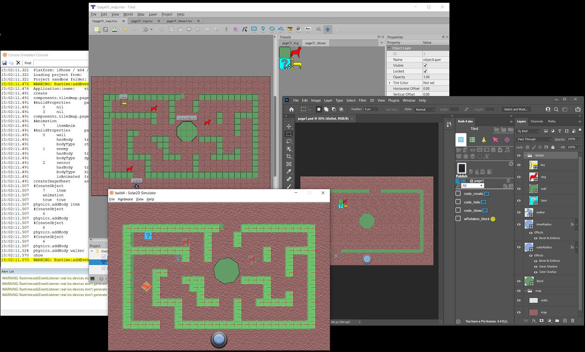
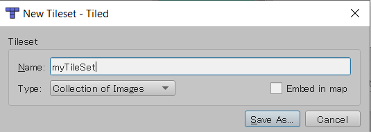
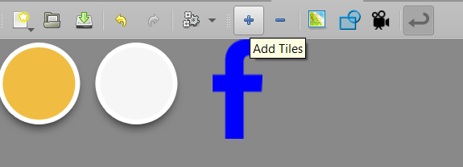
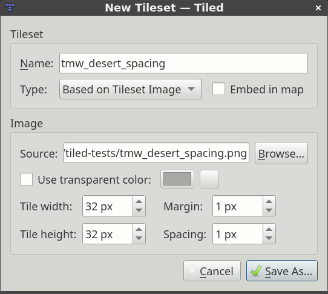
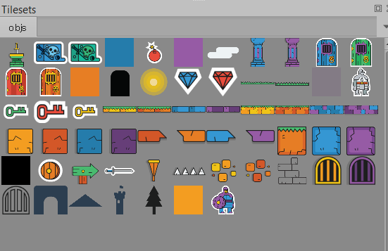
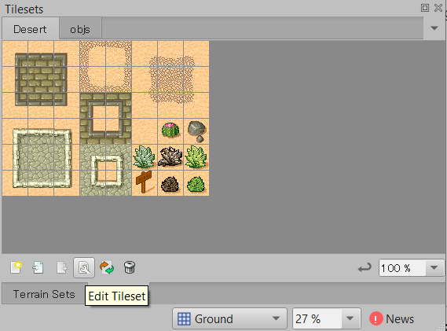
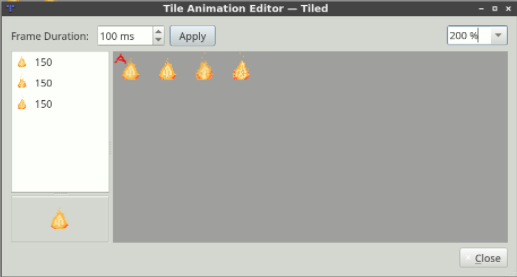
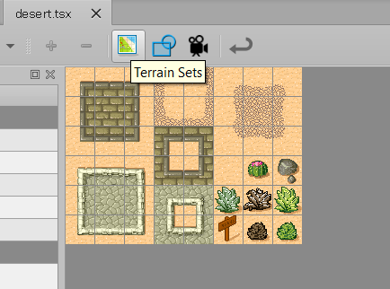
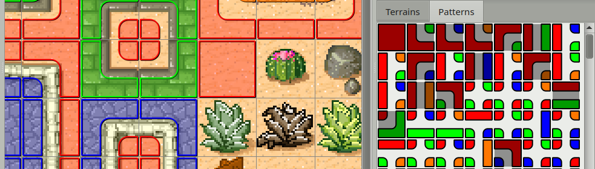
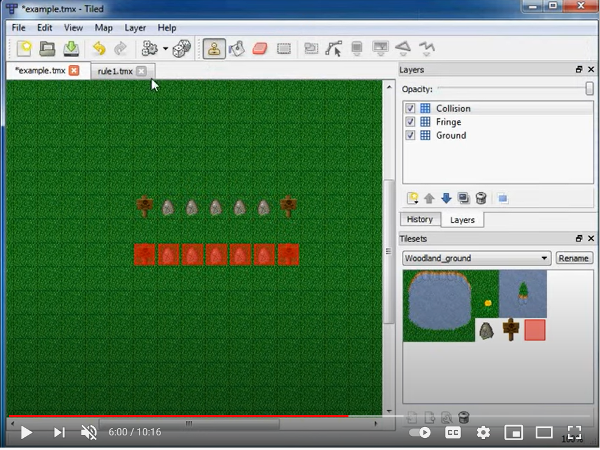

# Kwik with Tiled



Photoshop

1. Draw a map and objects - A
1. Draw a Tileset - B
1. Publish with Kwik

Tiled Editor

3. New Tileset 
    - Collection of Images
    - Add Tiles of A pngs

4. New Tileset
    - Based on Tileset Image
    - Source B png files

5. Add Layers
    - Image Layer for A's map
    - Object Layer for A's objects
    - Tile Layer holds tiles made out B
        - sensors
        - invisible boundaries or edges on A's map

## Method A - Collection of Images

1. New Tileset

    - create a new Tileset Type with Collection of Images

    

2. Edit Tileset > Add Tiles

    

TODO
- each image from Photoshop has (x, y), should it create an Importer with Scripting of Tiled Map Editor?


## Method B - Based on Tileset Image

- create a layer for Tileset in Photoshop

    

- export it as PNG

Tiled Edtior 

- create a new Tileset Type with Based on Tileset Image

    

    desert.tsx
    
    ```xml
    <?xml version="1.0" encoding="UTF-8"?>
    <tileset version="1.4" tiledversion="1.4.3" name="Desert" tilewidth="32" tileheight="32" spacing="1" margin="1" tilecount="48" columns="8">
        <image source="tmw_desert_spacing.png" width="265" height="199"/>
        ..
        ..

    ```
TODO

- importer to Photoshop?
    - JSON file exported from Tiled Map Editor 
    - import objects/tiles to Photoshop layer to work with Kwik?

## Animation 

- Tiled Editor

    > The tile with animation shows  a film mark

    

    - isAnimated = true in custom properties of Layer, Tile or Object
  
    Use external code of Kwik to control it with Sprite API

    - object:play()
    - object:pause()
    - object:setSequence()

- Kwik

    - let layer.obj link to map:getObjects( { name="obj" } )

        > this enables that buttons/animations created with Kwik will apply to instances out of Tiled Editor at the runtime.

    - external codes to access to the display objects from map:getObjects( { name="obj" } )

# Tiled

https://doc.mapeditor.org

## [Layers](https://doc.mapeditor.org/en/stable/manual/layers/)

- Tile Layer
- Object Layer
    - Rectangle
    - Ellipse
    - Point
    - Polygon - for when a rectangle or ellipse doesn’t cut it (often a collision area)
    - Polyline - can be a path to follow or a wall to collide with
    - Tile - for freely placing, scaling and rotating your tile graphics
    - Text
- Image Layer


---
## [Tile Layer](https://doc.mapeditor.org/en/stable/manual/editing-tile-layers/)

- B Stamp
    - Shift
    - Ctrl + Shift
    - z, y, z, Shift + z
- T Terrain
    - Shift
    - Ctrl
    - Alt + Shift, Alt + Ctrl

- F Bucket
    - Shift

- P Shape
    - Shift

- E Eraser
    - Shift

- R Select Rectangle
    - Shift, Ctrl, Ctl+Shift

- W Magic Wand
    - Shift, Ctrl, Ctl+Shift

- S Select Same Tile
    - Shift, Ctrl, Ctl+Shift

- Ctrl + 1-9 Copy
- 1-9 Paste

---
## [Object Layer](https://doc.mapeditor.org/en/stable/manual/objects/)

- R Rectangle
- I Point
- C Ellipse
- P Polygon
    - Polylines
        - right-click or press Enter while creating a polygon
- T Tile
- V [Template](https://doc.mapeditor.org/en/stable/manual/using-templates/#creating-template-instances)
- X Text

Operations
- Select 
- Move
- Resize
- Rotate
- Order
- Flip
- Edit Polygons

---
## Custom Properties 

- View > [Object Types Editor](https://doc.mapeditor.org/en/stable/manual/custom-properties/#general-setup)

---
## Object Templates 
- View > Views and ToolBars > [Template Editor](https://doc.mapeditor.org/en/stable/manual/using-templates/)
---
## TileSet 

[Two Types of Tileset](https://doc.mapeditor.org/en/stable/manual/editing-tilesets/#two-types-of-tileset)
- Based on Tileset Image
- Collection of Images

    

Editors

- Edit TileSet > [Tile Collision Editor]((https://doc.mapeditor.org/en/stable/manual/editing-tilesets/#tile-collision-editor))

    - View > Show Tile Collision Shapes

- Edit TileSet > [Tile Animation Editor](https://doc.mapeditor.org/en/stable/manual/editing-tilesets/#tile-animation-editor)
    - View > Show Tile Animation

        > Note - Solar2D does not support individual frame durations for animations.
        > Instead Berry of Tiled Library calculates the sum of all the frame durations for an animation and uses it for the time variable. 
        > Every frame will play at the same average duration.

    

    Collision Editor

    
    
    Animation Editor

    

### [Terrain](https://doc.mapeditor.org/en/stable/manual/terrain/)

- Edit Tileset > Terrain Sets

    

- marking the tiles for terrain generation

    

---
## [Automapping](https://doc.mapeditor.org/en/stable/manual/automapping/)
rules.txt
- http://www.youtube.com/watch?v=UUi0lD1pxyQ

    

---
# Lua 
- Berry
    - Properties inheritance

        Berry also applies the tile properties and layer properties and add these to the image object. Properties are assigned in prioirty:

        1. Object
        1. Tile
        1. Layer

    - hasBody

        This triggers **berry** to add a physics body to an object/tile and pass the rest of the custom properties as physics options
        - dynamic
        - static
        - kinematic    

        There is full support for every type of [Solar2D Physic Properties](https://docs.coronalabs.com/guide/physics/physicsBodies/index.html#properties). This also includes [Collision Filters](https://docs.coronalabs.com/guide/physics/collisionDetection/index.html#filtering) as well.  To enable a filter just set the custom property for `maskBits`, `categoryBits`, or `groupIndex` and it will be applied directly to a physics object. 

    - Animation

        These properties are the same as they are to [configure Solar2D sprites](https://docs.coronalabs.com/api/library/display/newSprite.html#sequencedata):

        - name
        - time
        - loopCount (optional) (defaults is 0 for infinite)
        - loopDirection (optional) 

        custom property
        
        - isAnimated
            1. Object
            2. Tile
            3. Layer
            4. Map (*note - only isAnimated property is checked and inherited for map)

            ```lua
            -- Example 1 --> only the map is set to true
            Map.isAnimated = true  
            -- Result = all animations will play

            -- Example 2 --> map is set to false and objects set to true
            Map.isAnimated = false
            Object1 -- no isAnimated property set
            Object2.isAnimated = true
            -- Result = Object 2 animation plays, Object 1 does not 

            -- Example 3 -->
            Map -- not set
            Layer1.isAnimated = true 
                Object1 -- not set
                Object2.isAnimated = false
            Layer2.isAnimated = false
                Object3 -- not set
                Object4.isAnimated = true
            Layer3 -- not set
                Object5
            -- Result = Object 1 and 4 animations plays, Object 2, 3, and 5 does not

            ```

    - TecturePacker 

        - Place the TexturePacker images and lua files inside the same directory as tilesetsDirectory and it will load them automatically
        - Or use the texturePackerDirectory to select the directory the TexturePacker images and files are located.
        - Or use map:addTexturePack( image_path, lua_path ) to load each texture pack individually.
        
        To insert a loaded texture pack sprite into the map 
      
        ```lua
        local layer = map:getLayer( "xxxx" )
        map:addSprite( layer, image_name, x, y )
        ```

- Sticker-Knight-Platformer-for-Berry-master
    - scene/game.lua

        ```lua
        -- Load our map
        local filename = event.params.nextMap or "scene/game/map/sandbox2.json"
        physics.start( )
        physics.setDrawMode( 'hybrid' )
        physics.setGravity( 0, 32 )
        map = berry:new( filename, "scene/game/map" )
        
        sceneGroup:insert( map )

        -- Find our hero!
        map.extensions = "scene.game.lib."
        map:extend( "hero" )
        hero = map:getObjects( { name="hero" } )
        hero.filename = filename
        hero:setSequence( 'idle' )

        -- Find enemy 
        local enemy = map:getObjects( {name="enemy" } )
        if enemy then 
            enemy:setSequence( 'enemyWalk' )
            enemy:play() 
        end	

        -- Find our enemies and other items
        map:extend( "coin", "exit", "spikes", "enemy", "blob", "label" )

        -- Find the parallax layer
        parallax = map:getLayer( "parallax" )

        ```

- [Open Game Art- sticker-knight-gfx.zip ](https://opengameart.org/content/sticker-knight-platformer)
    - https://opengameart.org/sites/default/files/sticker-knight-gfx.zip
