# Tiled Sample Project

The following opend source projects are used in this sample to work with Tiled Map Editor

- https://www.mapeditor.org/

Sticker-Knight-Platformer
- This is an open-source prototype of a fantasy themed platformer game
- https://ponywolf.itch.io/sticker-knight

Berry
- Berry is a simple Tiled Map loader for Solar2D SDK
- https://github.com/ldurniat/Berry

    Sticker-Knight-Platformer-for-Berry-master
    - https://github.com/ldurniat/Sticker-Knight-Platformer-for-Berry

## Kwik project 

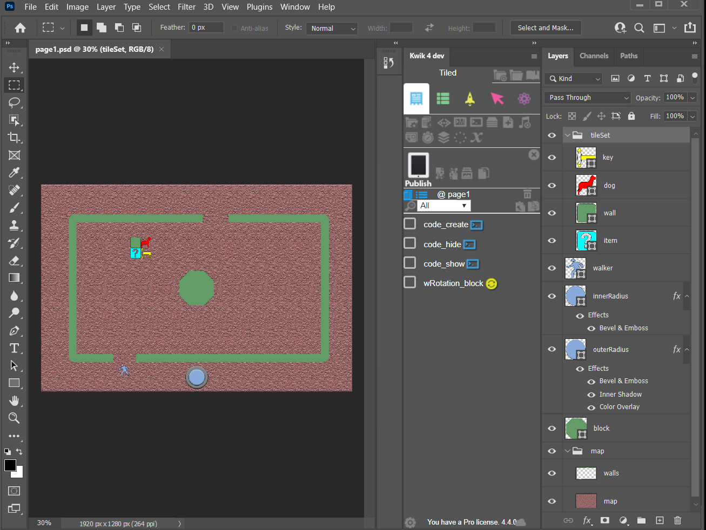

Layers

- tileSet
    - wall
    - dog
    - key
    - item
- walker
- a big block at the center
- map background

    > the walls are replaced with a map created with Tiled Editor

For joystick images

- innerRadius
- outterRadisu

### How it works

- publish images with Kwik
    - build4/assets/images/p1 folder has .png, @2x.png, @4x.png

- kwik is the system of 480 x 320.  So don't load @2x.png nor @4x.png to edit in Tiled Editor. Just load the png without @ suffix 

    *for instance, walkman.png, tileset.png must be used in Tiled Editor*.

- You create a tile width:64px height:64px in Photoshop. It will be treated as the dimension of a tile 16 x 16 in 480 x 320 system

- Tiled Editor project

    - orthogonal
    - right-down
    - width= 30 
    - height=20 
    - tilewidth= 16 
    - tileheight= 16 

    this makes 480 x 320 map 

----
## Tiled Project

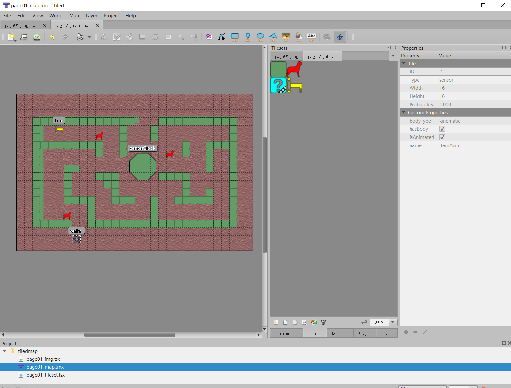

Project location

- build4/components/tiledmap
    - page01_map.tmx
    - page01_img.tsx
    - page01_tileset.tsx

        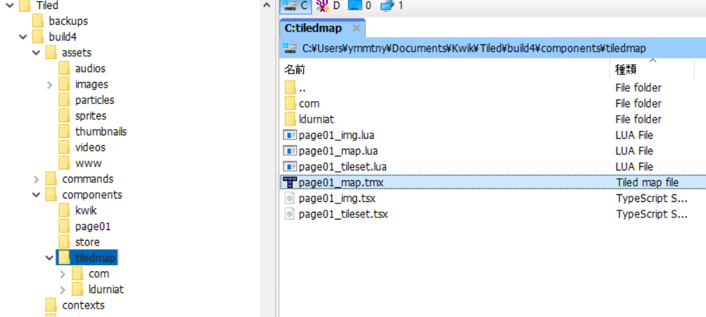


Tilesets

> the pngs files are located in build4/assets/images/p1 after you publish the project of Kwik

- page01_img 
    - Collection of Images

        **walker.png** and **block.png** published with Kwik are imported

    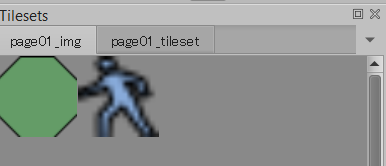

- page01_tileset

    - Based on Tileset Image

        **tileset.png** is imported as a tileset

    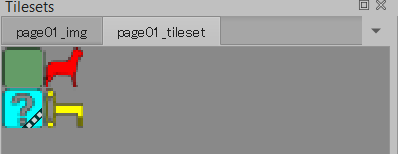


Tile Properties

- Edit Tileset > Select a tile

    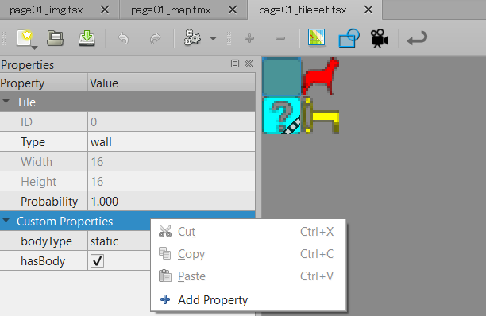

    Wall tile 
    
    - bodyType: static
    - hasBody: true

    Item tile
    
    - bodyType: sensor
    - hasBody: true
    - isAnimated: true
    - name: itemAnim

        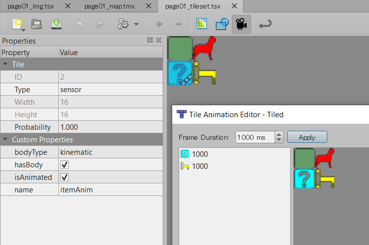

    Walker
    - Collision Editor is available

        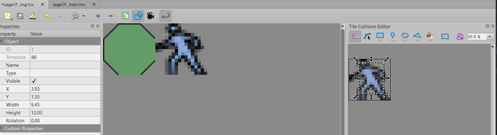

Layer

- objectLayer
    - walker, item, dog(enermy) are placed
- tileLayer
    - the pieces of the wall tile are placed to make the map

        
    
- mapImg
    - for reference, map.png from Kwik is placed


Objects
- select objectLayer and place the tiles from the tileset

    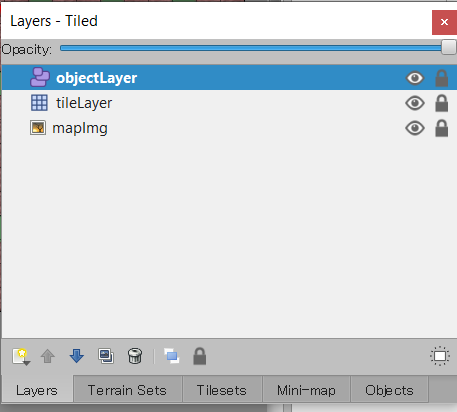

>these are named objects on objectLayer

- centerBlock
- walker
- item

    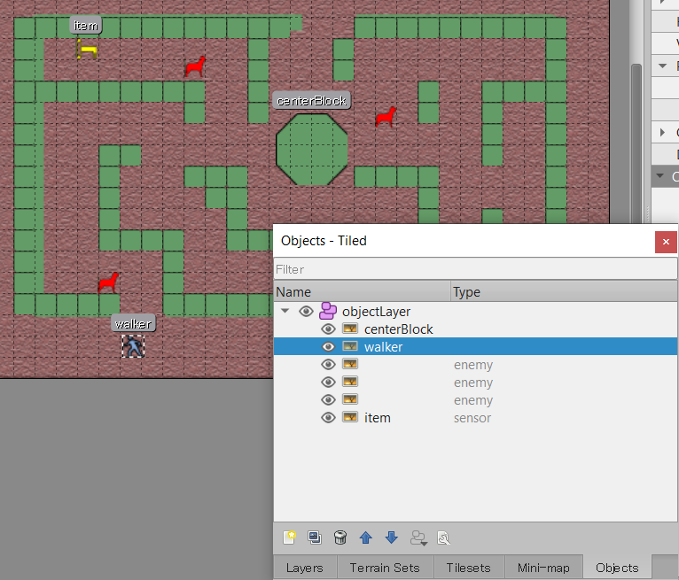

----
### Export As

The map information of layer, object, tileset etc are exported as lua files

page01_map.tmx >> page01_map.lua

page01_img.tsx >> page01_img.lua

page01_tileset.tsx >> page01_tileset.lua

- File > Export As

    

- Save as type: **Lua files(*.lua)**

    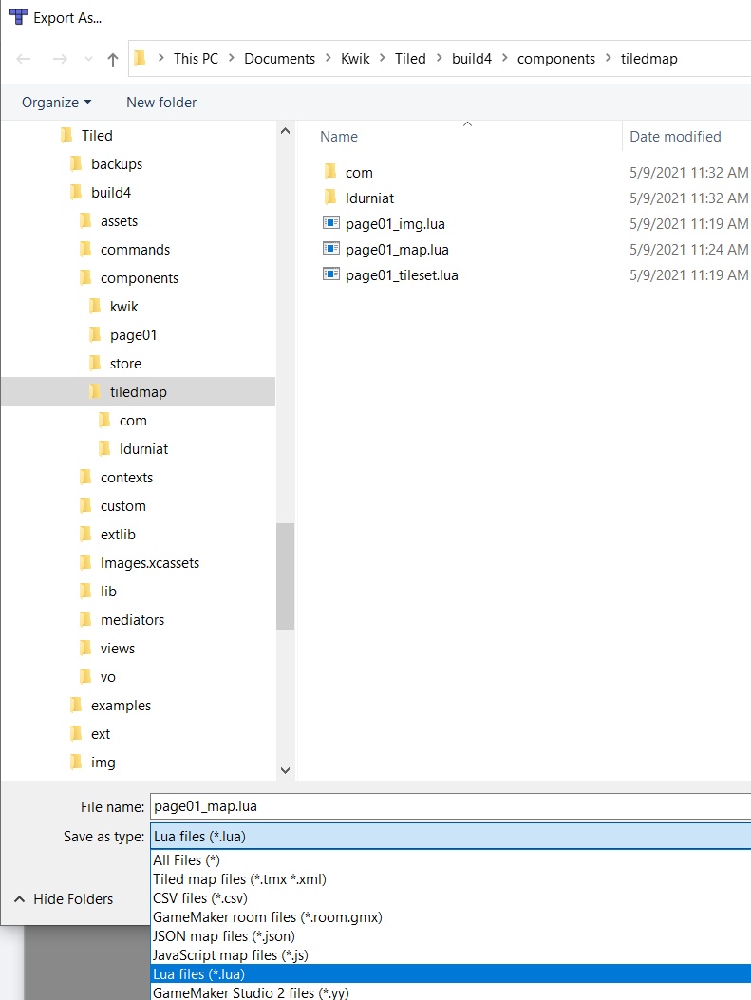

---
## External codes in Kwik

Now these lua files are placed in build4/components/tiledmap

- page01_map.lua
- page01_img.lua
- page01_tileset.lua

the following external codes are set in the project

- create_tiled.lua
    - After layers 
- show_tiled.lua
    - After buttons and actions
- hide_tiled.lua
    - Disposal

    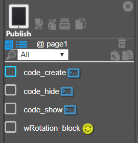

    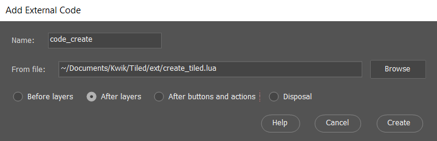

create_tiled.lua has the following features

- load the tiled map
- **joystick** controls walker
- place **block layer** that animates wRotation_block to the location of centerBlock defined in the tiled map
    - centerBlock of the tiled map is removed.

        > it is a demonstration how to reference an object in the tiled map

```lua

print("create")

local isSimulator = "simulator" == system.getInfo( "environment" )
local isMobile = ( "ios" == system.getInfo("platform") ) or ( "android" == system.getInfo("platform") )

-------------
require( "components.tiledmap.com.ponywolf.joykey" ).start()
if isMobile or isSimulator then
    local vjoy = require( "components.tiledmap.com.ponywolf.vjoy" )
    local stick = vjoy.newStick(1, "assets/images/p1/innerradius.png", "assets/images/p1/outerradius.png")
    stick.x, stick.y = display.contentCenterX, display.contentHeight - 24
    layer.stick = stick
end
-------------

local berry = require( 'components.tiledmap.ldurniat.berry' )
local physics = require( "physics" )

physics.start( )
physics.setDrawMode( 'hybrid' )
physics.setGravity(0,0)

layer.map = berry:new( 'components.tiledmap.page01_map', 'assets/images', nil, 'components.tiledmap.' )

---------------
-- use walker in the tiled map. waker and tileSet are replaced with  the ones in the tiled map
--
layer.walker.alpha = 0 -- or removeSelf()
layer.tileSet.alpha = 0

---------------
-- use the block animation of Kwik. the centerBlock of the tiled map is disabled
--
local block = layer.map:getObjects( { name="centerBlock" } )
layer.block.x = block.x
layer.block.y = block.y
block.alpha = 0 -- or removeSelf()

```

### external codes in ext folder

- ext/ folder contains the eternal codes
    - create_tiled.lua
    - show_tiled.lua
    - hide_tiled.lua

- main.lua for Solar2D simulator is a sandbox for prototyping external codes
  - it shows how to load a tiled map and how to use a joystick in lua

    - please change the path in main.lua
    ```lua
    ..
    ...
    package.path = package.path .. ";C:\\Users\\ymmtny\\Documents\\Kwik\\Tiled\\build4\\components\\tiledmap\\?.lua"
    ..
    ..
    map = berry:new( 'page01_map', '../build4/components/tiledmap' )
    ..
    ..

    require( "com.ponywolf.joykey" ).start()
    
    ```
